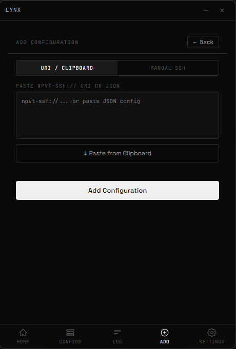
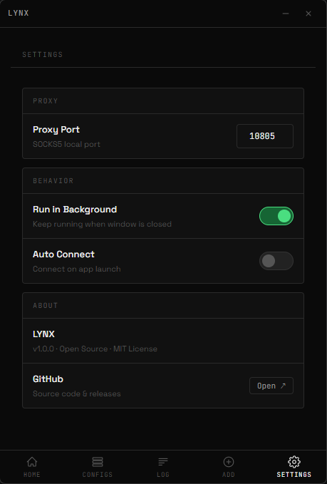

# LYNX

> Open-source SSH tunnel VPN & Proxy client — Windows · macOS · Linux

A lightweight, minimal desktop application for creating secure SOCKS5 proxy tunnels through any SSH server using the NPVT-SSH protocol. Built with Electron and ssh2.


---

## Screenshots

<p align="center">
  
  
</p>
<p align="center">
  
  
</p>

---

## Download

Grab the latest release for your platform:

| Platform | File |
|---|---|
| Windows | `LYNX.Setup.windows.x64.exe` |
| macOS | `LYNX.dmg` |
| Linux | `LYNX.AppImage` / `lynx.deb` |

→ [Latest Release](https://github.com/xkmikze/lynx/releases/latest)

---

## Features

- **NPVT-SSH Protocol** — Import configs via `npvt-ssh://` URI or paste JSON directly
- **Manual SSH Config** — Add servers manually (host, port, user, password)
- **SOCKS5 Proxy** — Exposes `127.0.0.1:10805` as a local SOCKS5 proxy
- **VPN Mode** — System-wide proxy routing
- **Real-time Log** — Live connection log with timestamps
- **Ping Configs** — Real TCP latency for each server
- **Speed Test** — Measures download speed through the active tunnel
- **Auto-reconnect** — Automatically reconnects if connection drops
- **Run in Background** — System tray support, stays alive when window is closed
- **Dark UI** — Clean black/white minimal interface
- **Auto Connect** — Optionally connect on app launch
- **Encrypted Storage** — Credentials stored encrypted on disk

---

## Quick Start

### Build from Source

```bash
# Requirements: Node.js 18+, npm
git clone https://github.com/xkmikze/lynx.git
cd lynx
npm install

# Development
npm run dev

# Build for your platform
npm run build        # Windows
npm run build:mac    # macOS
npm run build:linux  # Linux
```

---

## NPVT-SSH URI Format

The app accepts `npvt-ssh://` URIs — a base64-encoded JSON config:

```
npvt-ssh://<base64(JSON)>
```

Example JSON structure:
```json
{
  "sshConfigType": "SSH-Direct",
  "remarks": "My Server",
  "sshHost": "1.2.3.4",
  "sshPort": 22,
  "sshUsername": "user",
  "sshPassword": "pass",
  "dnsTTMode": "UDP",
  "udpgwTransparentDNS": true
}
```

---

## Proxy Usage

Once connected in **Proxy Mode**, configure your browser or system to use:

| Setting | Value |
|---|---|
| Protocol | SOCKS5 |
| Host | `127.0.0.1` |
| Port | `10805` (configurable) |

In **Firefox**: Preferences → Network → Manual proxy → SOCKS Host: `127.0.0.1`, Port: `10805`, SOCKS v5.

In **Chrome**: Use an extension like [Proxy SwitchyOmega](https://chrome.google.com/webstore/detail/proxy-switchyomega/padekgcemlokbadohgkifijomclgjgif).

---

## Project Structure

```
lynx/
├── src/
│   ├── main/
│   │   ├── main.js              # Electron main process
│   │   ├── tunnel-manager.js    # SSH + SOCKS5 tunnel
│   │   ├── proxy-server.js      # Proxy lifecycle
│   │   ├── ping-service.js      # TCP latency measurement
│   │   └── speed-test.js        # Download speed test
│   ├── renderer/
│   │   ├── index.html           # UI layout
│   │   ├── app.js               # UI logic
│   │   └── preload.js           # Secure IPC bridge
│   └── shared/
│       └── config-utils.js      # Config parsing & validation
├── assets/
│   └── icons/                   # App icons
├── docs/                        # Screenshots
├── package.json
├── .github/
│   └── workflows/
│       └── build.yml            # CI/CD — builds all platforms
└── README.md
```

---

## Security

- **Context Isolation** — Renderer has no access to Node.js APIs directly
- **Preload bridge** — All IPC channels are allowlisted
- **Encrypted store** — Credentials encrypted at rest via `electron-store`
- **No telemetry** — Zero data sent anywhere except your SSH server
- **Input validation** — All config fields validated before use
- **Single instance** — Prevents multiple conflicting tunnels

---

## Roadmap

- [x] Windows support
- [x] macOS support
- [x] Linux support
- [x] NPVT-SSH URI import
- [x] SOCKS5 proxy mode
- [x] System-wide VPN proxy mode
- [x] Real-time connection log
- [x] Ping & speed test
- [x] Auto-reconnect on disconnect
- [x] System tray
- [ ] VPN mode via TUN adapter
- [ ] SSH key authentication
- [ ] Config groups / tags
- [ ] DNS over HTTPS support
- [ ] Dark/light theme toggle
- [ ] Mobile companion app

---

## Contributing

Pull requests are welcome. For major changes, open an issue first.

```bash
npm run lint   # Lint
npm run pack   # Test build without installer
```

See [CONTRIBUTING.md](CONTRIBUTING.md) for guidelines.

---

## License

MIT © [LYNX Contributors](https://github.com/xkmikze/lynx)